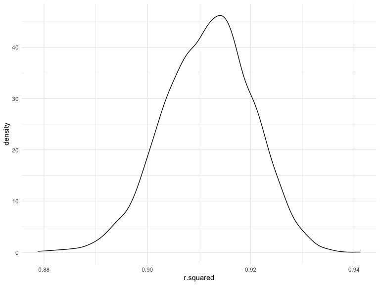

Homework 6
================
Yuan Meng
12/3/2021

``` r
library(tidyverse)
library(viridis)
library(modelr)
library(patchwork)
knitr::opts_chunk$set(
    echo = TRUE,
    warning = FALSE,
    fig.width = 8, 
  fig.height = 6,
  out.width = "90%"
)

options(
  ggplot2.continuous.colour = "viridis",
  ggplot2.continuous.fill = "viridis"
)

scale_colour_discrete = scale_colour_viridis_d
scale_fill_discrete = scale_fill_viridis_d

theme_set(theme_minimal() + theme(legend.position = "bottom"))
```

## Problem 1

### Data Cleaning

``` r
birth_weight= read_csv("./data/birthweight.csv") %>% 
  janitor::clean_names() %>% 
  mutate(babysex = as.factor(babysex),
         frace = as.factor(frace),
         malform = as.factor(malform),
         mrace = as.factor(mrace)) %>% 
  mutate(babysex = recode(babysex,"1" = "male","2" = "female"),
         frace = recode(frace, "1" = "White", "2" = "Black", "3" = "Asian", "4" = "Puerto Rican", "8" = "Other",                        "9" = "Unknown"),
         malform = recode(malform, "0" = "absent", "1" = "present"),
         mrace = recode(mrace, "1" = "White", "2"= "Black", "3" = "Asian", "4" = "Puerto Rican", "8" = "Other"))
```

### check missing data

``` r
 birth_weight %>% 
  skimr::skim() %>% 
  select(skim_variable, n_missing)
```

    ## # A tibble: 20 × 2
    ##    skim_variable n_missing
    ##    <chr>             <int>
    ##  1 babysex               0
    ##  2 frace                 0
    ##  3 malform               0
    ##  4 mrace                 0
    ##  5 bhead                 0
    ##  6 blength               0
    ##  7 bwt                   0
    ##  8 delwt                 0
    ##  9 fincome               0
    ## 10 gaweeks               0
    ## 11 menarche              0
    ## 12 mheight               0
    ## 13 momage                0
    ## 14 parity                0
    ## 15 pnumlbw               0
    ## 16 pnumsga               0
    ## 17 ppbmi                 0
    ## 18 ppwt                  0
    ## 19 smoken                0
    ## 20 wtgain                0

There is no missing values in the data set.

### Regression

``` r
weight_fit = 
  birth_weight  %>% 
  lm(bwt ~ momage + smoken + ppbmi + fincome, data = .)  #proposed model
```

I proposed that baby’s birth weight associated with `fincome` (family
income), `momage` (mother’s age at delivery), `smoken` average number of
cigarettes smoked per day during pregnancy and `ppbmi`mother’s
pre-pregnancy BMI.

``` r
 birth_weight %>% 
  modelr::add_residuals(weight_fit) %>% 
  modelr::add_predictions(weight_fit) %>% 
  ggplot(aes(x = pred, y = resid)) + geom_point()+
  geom_smooth(se = FALSE, method = lm)
```

    ## `geom_smooth()` using formula 'y ~ x'


### Other two models

Using length at birth and gestational age as predictors (main effects
only)

``` r
weight_fit = 
  birth_weight %>% 
    lm(bwt ~ momage + smoken + ppbmi + fincome, data = .)  #proposed model
```

``` r
weight_fit %>% 
   broom::tidy() %>% 
  knitr::kable(digits = 3)
```

| term        | estimate | std.error | statistic | p.value |
|:------------|---------:|----------:|----------:|--------:|
| (Intercept) | 2465.627 |    63.077 |    39.089 |       0 |
| momage      |   12.189 |     2.079 |     5.864 |       0 |
| smoken      |   -6.475 |     1.029 |    -6.296 |       0 |
| ppbmi       |   14.454 |     2.394 |     6.037 |       0 |
| fincome     |    2.639 |     0.309 |     8.530 |       0 |

Using head circumference, length, sex, and all interactions (including
the three-way interaction) between these

``` r
birth_weight %>% 
  lm(bwt ~ bhead + blength + babysex + bhead*blength 
                 + bhead*babysex + blength*babysex + bhead*blength*babysex, 
                 data = .) %>%
  broom::tidy() 
```

    ## # A tibble: 8 × 5
    ##   term                         estimate std.error statistic      p.value
    ##   <chr>                           <dbl>     <dbl>     <dbl>        <dbl>
    ## 1 (Intercept)                 -7177.     1265.       -5.67  0.0000000149
    ## 2 bhead                         182.       38.1       4.78  0.00000184  
    ## 3 blength                       102.       26.2       3.90  0.0000992   
    ## 4 babysexfemale                6375.     1678.        3.80  0.000147    
    ## 5 bhead:blength                  -0.554     0.780    -0.710 0.478       
    ## 6 bhead:babysexfemale          -198.       51.1      -3.88  0.000105    
    ## 7 blength:babysexfemale        -124.       35.1      -3.52  0.000429    
    ## 8 bhead:blength:babysexfemale     3.88      1.06      3.67  0.000245

``` r
cv_df = 
  crossv_mc(birth_weight, 100) 
```

``` r
cv_df =
  cv_df %>% 
  mutate(
    train = map(train, as_tibble),
    test = map(test, as_tibble))
```

``` r
cv_df = 
  cv_df %>% 
  mutate(
    my_model_fit  = map(train, ~lm(bwt ~ momage + smoken + ppbmi + fincome, data =  birth_weight)),
    fit_mod1  = map(train, ~lm(bwt ~ blength + gaweeks, data = .x)),
    fit_mod2  = map(train, ~lm(bwt ~ bhead + blength + babysex + bhead*blength 
                 + bhead*babysex + blength*babysex + bhead*blength*babysex, data = .x))) %>% 
  mutate(
    rmse_my_model = map2_dbl(my_model_fit, test, ~rmse(model = .x, data = .y)),
    rmse_mod1 = map2_dbl(fit_mod1, test, ~rmse(model = .x, data = .y)),
    rmse_mod2 = map2_dbl(fit_mod2, test, ~rmse(model = .x, data = .y)))
```

``` r
cv_df %>% 
  select(starts_with("rmse")) %>% 
  pivot_longer(
    everything(),
    names_to = "model", 
    values_to = "rmse",
    names_prefix = "rmse_") %>% 
  mutate(model = fct_inorder(model)) %>% 
  ggplot(aes(x = model, y =rmse, fill = model)) + geom_violin(alpha = .5) + 
  geom_boxplot(alpha = .3) +
  labs(
    title = "RMSEs of the 3 models",
    y = "Root Mean Squred Error",
    x = "Models"
  )
```


Problem 2

``` r
weather_df = 
  rnoaa::meteo_pull_monitors(
    c("USW00094728"),
    var = c("PRCP", "TMIN", "TMAX"), 
    date_min = "2017-01-01",
    date_max = "2017-12-31") %>%
  mutate(
    name = recode(id, USW00094728 = "CentralPark_NY"),
    tmin = tmin / 10,
    tmax = tmax / 10) %>%
  select(name, id, everything())
```

    ## Registered S3 method overwritten by 'hoardr':
    ##   method           from
    ##   print.cache_info httr

    ## using cached file: ~/Library/Caches/R/noaa_ghcnd/USW00094728.dly

    ## date created (size, mb): 2021-10-07 10:26:59 (7.602)

    ## file min/max dates: 1869-01-01 / 2021-10-31

### R.squared

``` r
r_squared = 
  weather_df %>% 
  bootstrap(n = 5000, id = "strap_number") %>% 
  mutate(
    models = map(.x = strap, ~lm(tmax~tmin, data = .x)),
    results = map(models, broom::glance)
  ) %>% 
  select(-models, -strap) %>% 
  unnest(results) 
```

``` r
r_squared %>% 
  summarize(
    ci_lower = quantile(r.squared, 0.025),
    ci_upper = quantile(r.squared, 0.975)
  )
```

    ## # A tibble: 1 × 2
    ##   ci_lower ci_upper
    ##      <dbl>    <dbl>
    ## 1    0.894    0.928

``` r
r_squared %>% 
  ggplot(aes(x = r.squared)) + 
   geom_density() 
```


